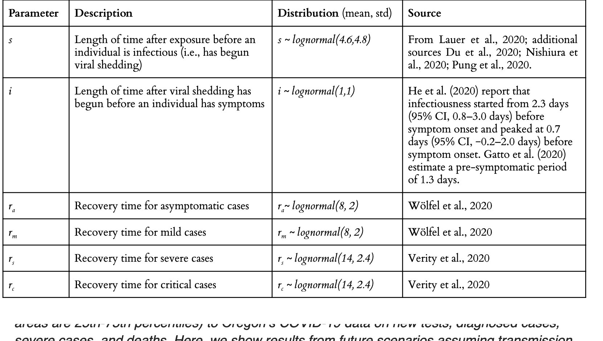

## Age analysis file

This is a file documenting the day-by-day count of cumulative and new cases by age, as well as the cumulative count of hospitalizations and deaths by age.

The daily age files, parsed from OHA's daily html updates [here](https://govstatus.egov.com/OR-OHA-COVID-19) are available in the age\_raw\_from\_html files.

This is a working analysis file so there's possibly more columns than anyone would want or need. I added some aggregate age groups (e.g. 30-59 though I can't really remember why--this was written in April or May I think). 

**Cumulative case counts** have column headers like cases\_10\_to\_19

**New cases** have headers like new\_cases\_10\_to\_19 . New cases are the number from the current day minus the number for the prior day. At some point OHA stopped updating their html page on weekends, so the Monday numbers are artificially larger. Same for three day weekends etc. 

**Daywise age percents of daily new cases** are given by columns like new\_case\_prcnt\_0\_to\_29

**Cumulative hospitalizations** are in columns like hosp\_40\_to\_49

**Cumulative hospital percentages** are in columns like p\_hosp\_20\_to\_29

**Cumulative deaths** are in columns like death\_50\_to\_59 

**Cumulative death percentages by age** are in columns like p\_death\_20\_to\_29

## References 

There's an extensive literature documenting the values you might need; because OR originally relied on Covasim (now maybe Rainier) you might start at the [Covasim paper](https://covid.idmod.org/data/Covasim_model_report.pdf) which includes this graphic:

I haven't compared any of the observed OR values to estimates though it might be interesting to do so.

